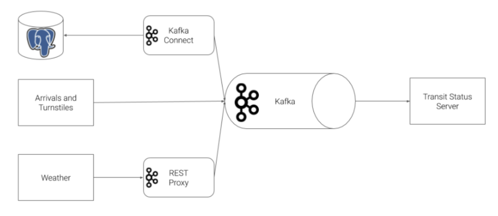
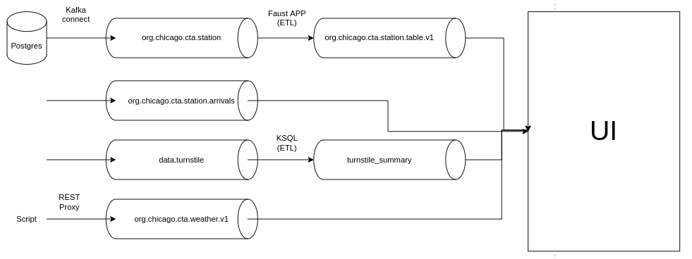
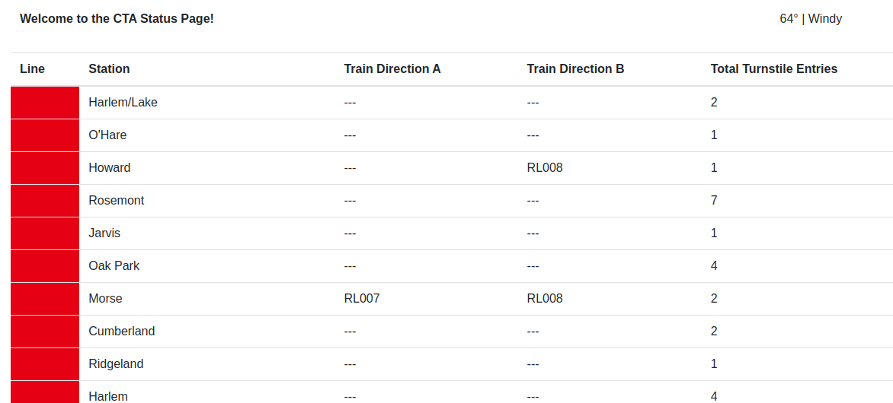
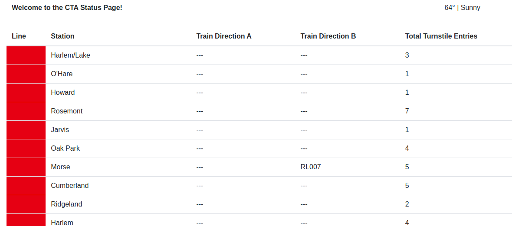
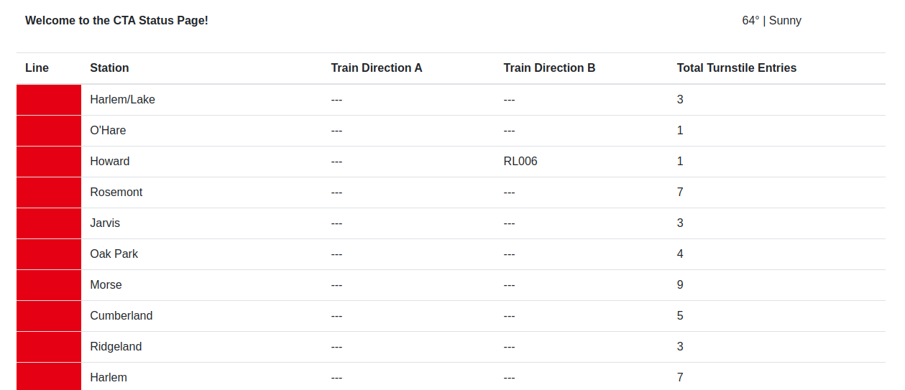

# Kafka-Optimizing-Public-Transportation

## 1 - Introduction and project overview

This project was developed during Udacity's "Data Streaming" Nanodegree program , using the available workspace.

The main objective was to practice Kafka streaming and the several tools involved in Kafka's ecosystem such as KSQL, Kafka connectors, rest APIs and Faust.

The project simulates  fours different streams of data related to public transport. These streams are consumed, transformed and then new topics are produced to fed a simple dashboard page that displays the infos.

The diagrams below illustrates the architecture described above:






## 2 - Tecnologies and tools used
* Language: Python 3.9
* Database: Postgres
* Tools: Kafka, OOP, Faust, KSQL, Kafka Connect, Kafka REST Proxy


## 3 - Infrastructure
### 3.1 - Producers
#### 3.1.1 - Postgres Database
Database containing a table called stations. It connects with our Kafka application througth a Kafka Connect JDBC Source connector to place into Kafka using the topic "org.chicago.cta.stations".

The connection is configured at "producers/connector.py file

The stations table has this schema:
```
stop_id INTEGER PRIMARY KEY,
direction_id VARCHAR(1) NOT NULL,
stop_name VARCHAR(70) NOT NULL,
station_name VARCHAR(70) NOT NULL,
station_descriptive_name VARCHAR(200) NOT NULL,
station_id INTEGER NOT NULL,
order INTEGER,
red BOOLEAN NOT NULL,
blue BOOLEAN NOT NULL,
green BOOLEAN NOT NULL
```
#### 3.1.2 - Trains arrivals
Simulation of the arrival of a train in a certain station. Produces into "org.chicago.cta.station.arrivals" topic and is created at producers/station.py file.

Has the following schema:
```json
{
  "station_id": "int",
  "train_id": "String",
  "direction": "String",
  "line": "String",
  "train_status": "String",
  "prev_station_id": "int",
  "prev_direction": "String"
}
```

#### 3.1.3 - Turnstile
Simulation of a passenger entering a certain station. Produces into "data.turnstile" topic and is created at producers/turnstile.py file.

Has the following schema:
```json
{
  "station_id": "int",
  "station_name": "String",
  "line": "String"
}
```

#### 3.1.4 - Whether informations
A python script that runs periodically and emits whether data and connects with Kafka via Rest Proxy API. The data in sinked using "org.chicago.cta.weather.v1" topic. The connection with the Rest Proxy API is made at the producers/weather.py file.

Has the following schema:
```json
{
  "temperature": "float",
  "status": "String"
}
```
### 3.2 - Consumers

#### 3.2.1 - Faust

A Faust application is build to consume data from "org.chicago.cta.stations"  (extract) and transform it removing some of the fields and getting the right color of the station. Than it loads this transformed data into a topic called "org.chicago.cta.stations.table.v1". The file containing the scripts is consumers/faust_stream.py.

Has the following schema:
```json
{
  "station_id": "int",
  "station_name": "String",
  "order": "String",
  "line": "String"
}
```
#### 3.2.2 - KSQL

To aggregate the turnstile information a KSQL server was used. It consumed data from "data.turnstile" and load it into a KSQL table called "turnstile". After that another table is created called "turnstile_summary" that contains the sum of passengers in each stations, based on the turnstile table. This "turnstile_summary" is streamed as a topic with the same name. The file containing the scripts is consumers/ksql.py.

Has the following schema:
```json
{
  "station_id": "int",
  "count": "int"
}
```

### 3.3 - Topics
* org.chicago.cta.stations
* org.chicago.cta.station.arrivals
* data.turnstile
* org.chicago.cta.weather.v1
* org.chicago.cta.stations.table.v1
* turnstile_summary

## 4 - Project folders/files

```
Optimizing Public Transportation
|____README.md
|____startup.sh
|____.gitignore
|
|____ images
|
|____ producers
| |____ __init__.py
| |____ connector.py
| |____ simulation.py
| |____ logging.ini
| |____ requirements.txt
| |
| |____ data
| | |____ README.md
| | |____ cta_stations.csv
| | |____ ridership_curve.csv
| | |____ ridership_seed.csv
| |
| |____ models                      
| | |____ __init__.py
| | |____ line.py
| | |____ producer.py
| | |____ station.py
| | |____ turnstile.py
| | |____ train.py
| | |____ turnstile_hardware.py
| | |____ weather.py
| | |
| | |____ schemas                    
| | | |____ arrival_key.json
| | | |____ arrival_value.json
| | | |____ turnstile_key.json
| | | |____ turnstile_value.json
| | | |____ weather_value.json
| | | |____ weather_key.json
|
|____ consumer
| |____ __init__.py
| |____ consumer.py
| |____ faust_stream.py             
| |____ ksql.py
| |____ logging.ini
| |____ requirements.txt
| |____ server.py                    
| |____ topic_check.py
| |                     
| |____ models                       
| | |____ __init__.py
| | |____ line.py
| | |____ lines.py
| | |____ station.py
| | |____ weather.py
| |
| |____ templates
| | |____ status.html
| |
```
## 5 - Project detailed

### 5.1 - Setup

Run startup.sh. This will initialize all of the services.
```
./startup.sh
```

### 5.2 - Running simulation

- Start the simulations
  
```
cd producers
python simulation.py
```
- Running simulation will
  * Triggers the weather script
  * Connects the postgres kafka connector


### 5.3 - Faust Stream Processing Application

- Start the Faust Application
  
```
cd consumers
faust -A faust_stream worker -l info
```
- Running the faust application will start the ETL from the data of the topic "org.chicago.cta.stations" and sinking it into "org.chicago.cta.stations.table.v1".

### 5.4 - KSQL Creation Script

- Start the KSQL tables
```
cd consumers
python ksql.py
```
- Running this scripts will create the desired tables
### 5.5 - Dashbord
- Start the Dashboard Server
```
cd consumers
python server.py
```
- Starting the server an app will consume the generated topics and will show in an UI the locations of the trains, the total passengers in each station and the temperature. 




